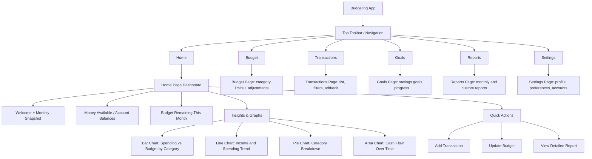

# Budgeting App Mockup

This mockup uses Mermaid to represent the app structure and home page dashboard layout.

## Notes

- The home page is focused on quick financial awareness.
- The toolbar provides easy movement between core budgeting workflows.
- Graphs can be powered by real transaction and budget data from your backend.
