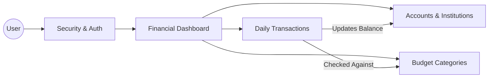

# Aquatic Pandas Budget Management System

Aquatic Pandas is a Flask + MySQL budget tracking backend with user authentication, account management, category budgeting, and transaction tracking, all running in a Docker container. This project provides a robust foundation for personal financial data management, featuring a clean RESTful API, structured database models, and a pre-configured environment designed to streamline the development-to-deployment workflow.

## Project Structure



## Tech Stack

- Python 3.11
- Flask 3.0
- Flask-SQLAlchemy
- SQLAlchemy 2.0
- Flask-Login
- MySQL 8.0
- Docker / Docker Compose

## Current Status

- Backend API is implemented and runs from `app.py`.
- Authentication uses Flask-Login session cookies (not token-based auth).
- CRUD endpoints exist for users, accounts, categories, and transactions.
- MySQL schema is defined in `init.sql` and mirrored by SQLAlchemy models in `models.py`.
- Docker setup is available for local development.
- HTML templates exist in `templates/`, but they are not wired into Flask routes in the current code.
- Notes and Gaps
    - Existing templates and static assets are not connected to Flask view routes yet.
    - Planned routes in this README are explicitly marked and may not exist yet in `routes.py`.
    - There is no automated test suite in the repository at this time.

## Run the App

It is recommended to run in a Linux/WSL environment with Docker and Docker Compose installed.

### Run With Docker (Recommended)

1. Copy and Setup Environment

```bash
cp .env-example .env && nano .env
```

2. Start Services

```bash
docker compose up --build
```

3. Access Services

- App: `http://localhost:3000`
- MySQL: `http://localhost:3306`

4. Stop services:

```bash
docker compose down --remove-orphans
```

### Run Locally (Without Docker, and NOT RECOMMENDED)

1. Create and activate a virtual environment.

```bash
python3 -m venv venv
source venv/bin/activate
```

2. Install dependencies:

```bash
pip install -r requirements.txt
```

3. Create MySQL database and run schema:

```bash
mysql -u <user> -p <database_name> < init.sql
```

4. Copy environment template and set local values:

```bash
cp .env.example .env
```

5. Start app:

```bash
python app.py
```

### Useful Commands

```bash
# view logs
docker-compose logs -f app
docker-compose logs -f db

# open MySQL shell in container
docker-compose exec db mysql -u pandas_user -p aquatic_pandas
```
